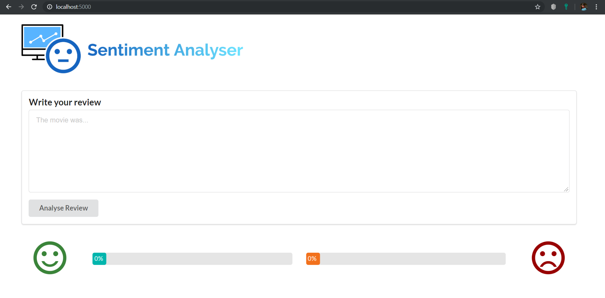

## React Sentiment Analysis React App

This project directory contains the built react app in the [build](./build) directory and the react source code files in the [react-code](./react-code) directory (excluding the node_modules and package files).

## Run App

To run the built react app open a terminal in this directory and run the following commands
```bash
$ npm install -g serve
$ serve -s build
```

